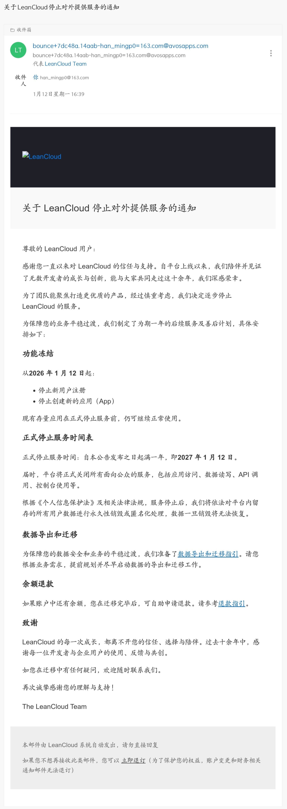

LeanCloud 宣布一年后停止对外服务。看到通知时，我第一时间想到：Valine用户怎么办？

我在几个月前就把评论系统从 Twikoo + LeanCloud 的组合迁到了 Giscus。主要是因为对于评论邮件通知功能的困扰和 Twikoo 后端维护属实困难。便看中了Giscus 的零成本、零维护的简单。

但这次事件暴露了一个大问题：免费服务（如Api，数据库）的可持续性始终是一个迷。LeanCloud 已经安安稳稳的跑了那么多年，却也会发生问题。数据在别人手里，服务便完全取决于厂商——能有一年缓冲期便是万幸，更多服务是悄无声息地直接关闭。

对于还在用 LeanCloud 存储评论数据的建议：

1. 立即备份数据
2. 考虑 Waline和Twikoo（数据库服务配置多），Artalk（依靠服务器）或 giscus（基于Github）等评论系统
3. 选择时把数据导出功能和可自托管放在优先级前列

数据对于一个博客是最重要的，必须掌握在自己手里。即使是有付费的服务，最后也可能会面临突发事件。
