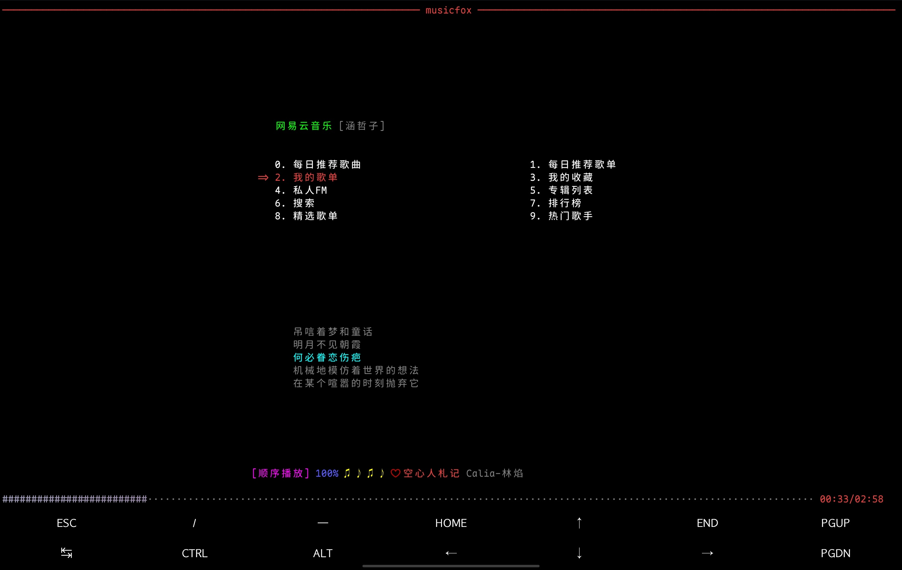

昨天，我突发奇想打算找个TUI播放器在Termux的Arch里使用，但是，发生了一些令人不悦的小插曲。

## 问题

当我找了一款名为 `go-musicfox` 的支持网易云的终端音乐播放器并尝试播放一首歌试试时，该应用报了一些错：

```console
$ musicfox
ALSA lib confmisc.c:855:(parse_card) [error.core] cannot find card '0'
ALSA lib conf.c:5207:(_snd_config_evaluate) [error.core] function snd_func_card_inum returned error: No such file or directory
ALSA lib confmisc.c:422:(snd_func_concat) [error.core] error evaluating strings
ALSA lib conf.c:5207:(_snd_config_evaluate) [error.core] function snd_func_concat returned error: No such file or directory
ALSA lib confmisc.c:1342:(snd_func_refer) [error.core] error evaluating name
ALSA lib conf.c:5207:(_snd_config_evaluate) [error.core] function snd_func_refer returned error: No such file or directory
ALSA lib conf.c:5730:(snd_config_expand) [error.core] Evaluate error: No such file or directory
ALSA lib pcm.c:2722:(snd_pcm_open_noupdate) [error.pcm] Unknown PCM default
ALSA lib confmisc.c:855:(parse_card) [error.core] cannot find card '0'
ALSA lib conf.c:5207:(_snd_config_evaluate) [error.core] function snd_func_card_inum returned error: No such file or directory
ALSA lib confmisc.c:422:(snd_func_concat) [error.core] error evaluating strings
ALSA lib conf.c:5207:(_snd_config_evaluate) [error.core] function snd_func_concat returned error: No such file or directory
ALSA lib confmisc.c:1342:(snd_func_refer) [error.core] error evaluating name
ALSA lib conf.c:5207:(_snd_config_evaluate) [error.core] function snd_func_refer returned error: No such file or directory
ALSA lib conf.c:5730:(snd_config_expand) [error.core] Evaluate error: No such file or directory
ALSA lib pcm.c:2722:(snd_pcm_open_noupdate) [error.pcm] Unknown PCM default
```

e...这说实话并不是一个所期望的理想输出。那到底是什么情况呢？通过这一大堆的error，我们可以很轻易的看出，似乎 ALSA 这个 `Linux 内核底层的音频驱动架构` 工作的并不太顺利。

ALSA 作为 Linux 内核的底层音频接口，需要直接操作硬件。其对所需求的应用提供音频接口，通过驱动等和硬件进行通信。当该应用 `musicfox` 尝试调用其中的一个接口发出播放的请求时，ALSA 需要定位可用设备并对音频通道等采取初始化。

然而，在 Termux 的 Proot 环境中，这条本应正常运行的链路发生了断裂。`proot-distro`虽然通过模拟实现了一个基本的、以发行版为基础的生产环境，但并未提供对一些硬件节点的直通访问。因此，尽管 musicfox 能正常加载 ALSA 库，但内核层面却返回了空集——其报错中的第一条"cannot find card '0'" 正是 ALSA 遍历其相关列表时无法寻找到任何有效声卡驱动的有力证据。

既然在 Proot 环境内无法直接地调用硬件，那么可以尝试使音频通过其他方式绕过 Proot，由 Termux 本体代为输出。即理论上可通过以下方案实现：

Proot 内的所需求应用 -> ALSA -> PulseAudio 客户端 -> Termux 本体所开启的 PulseAudio 服务器 -> Termux 本体调用硬件 -> 系统音频输出

其方案主要在于：在 Proot 内部配置 ALSA 的 PulseAudio 插件即如`alsa-plugins-pulse`（本文所提到的问题应用`go-musicfox`只能使用 ALSA），将原本指向硬件的相关请求重定向至 PulseAudio 的转接层；同时确保 Termux 本体已运行 `pulseaudio` 服务并开启监听。

如此，所需求应用便可通过中间层 PulseAudio 来正常播放音频了。那么，既然理论存在，实践开始！

## 解决

### 配置 Termux 本体的 PulseAudio 服务

1. 在 Termux 安装 PulseAudio

在 Termux 内（非 proot-distro 环境内）执行：

```shell
pkg install  pulseaudio
```

2. 在 Termux 内启动 PulseAudio 服务

使用下列命令来启动服务：

```shell
pulseaudio --start --load="module-native-protocol-tcp auth-ip-acl=127.0.0.1" --exit-idle-time=-1
```

3. （可选）将服务启动命令写入 Shell 配置文件

为了方便使用，可将该启动命令写入相关文件（如自动打开 proot-distro 的命令前或其他文件，根据自己情况配置，非必要）

### 配置 proot-distro 下的 PulseAudio 客户端

1. 在 proot-distro 内安装 PulseAudio

根据自己所使用的相应发行版的软件安装方法以安装该软件，以 Archlinux 做演示（包名视发行版而定）：

```shell
sudo pacman -S pulseaudio
```

2. 设置 PulseAudio 相关环境变量以配置服务器地址

根据自己所使用的相应 Shell 变量声明方法以配置 `PULSE_SERVER` 变量，以 Fish 做演示：

```fish
set -gx PULSE_SERVER 127.0.0.1
```

为了之后打开不用重新声明，可将该环境变量写入相关文件（如 fish.config 等 Shell 配置文件，根据自己情况配置，非必要）

3. 在 proot-distro 内安装 `alsa-plugins` 插件

根据自己所使用的相应发行版的软件安装方法以安装该插件，以 Archlinux 做演示（包名视发行版而定）：

```shell
sudo pacman -S alsa-plugins
```

4. 新建`~/.asoundrc` 并写入以下内容：

```conf title="~/.asoundrc"
pcm.!default {
    type pulse
    fallback "sysdefault"
    hint {
        show on
        description "Default ALSA Output (PulseAudio)"
    }
}

ctl.!default {
    type pulse
    fallback "sysdefault"
}
```

### 测试

目前，我们已经完成了相关配置，接下来便可以在 Proot 环境内播放音频试一试了。



可见，musicfox已经可以正常播放了。
