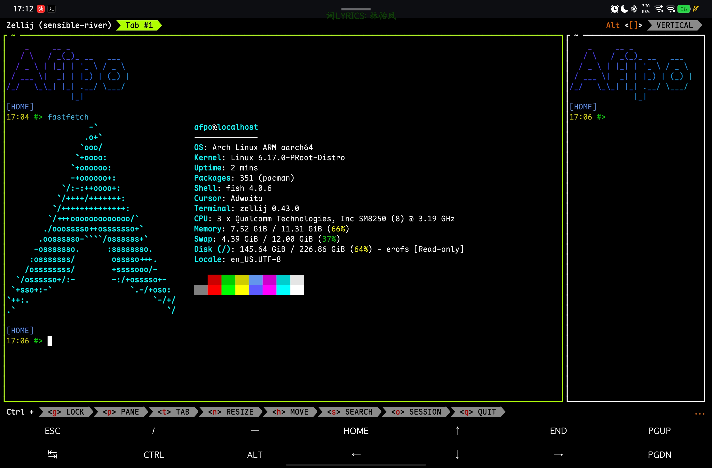

前些时候在 `Termux` 里更新工作环境并增加点功能，结果发现 `Tmux` 的 `prefix` 根本用不了，于是打算找点其它的终端复用器。看了一圈，一眼就相中了使用 `rust` 的 `Zellij`，就试了一下。


使用 `pacman` 安装很简单，但是马上就遇到了 `$SHELL` 的问题，于是在 `~/.config/fish/config.fish` 里加了下环境变量就好了。先简单体验了一下，启动速度对我来说 `Tmux` 没有什么明显区别，但 `Zellij` 界面更现代些；状态栏比较信息全，适应期不会出现忘记快捷键去问ai的情况。

:::note
也可以在 `~/.config/zellij/config.kdl` 里加了一行 `default_shell "fish"` 解决（可以直接取消注释）。
:::

快捷键的设计和 `Tmux` 比起来有些不同。呈现一个 tree 帮助理解下：
```txt
KeyBoard
├── Ctrl+P(Pane)
│   ├── Close
│   ├── Move
│   ├── New
│   └── other...
├── Ctrl+T(Tag)
│   ├── Close
│   ├── Move
│   ├── New
│   └── other...
└── other...
```

还没有装插件和主题，以后看情况添加。~~（说实话我其实并没有看懂它文档的主题部分的内容）~~

目前体验了几段时间，没碰到什么大问题。但是感觉文档不太清晰易懂~~（也有可能是我的原因）~~，但基本够用。在我看来，一个可以在 `CLI` 里分出多个窗口的功能是刚需，虽然平常不用，但在写代码需要这边 `:w` 完那边直接接上 `run` 的情况还是很实用的。
